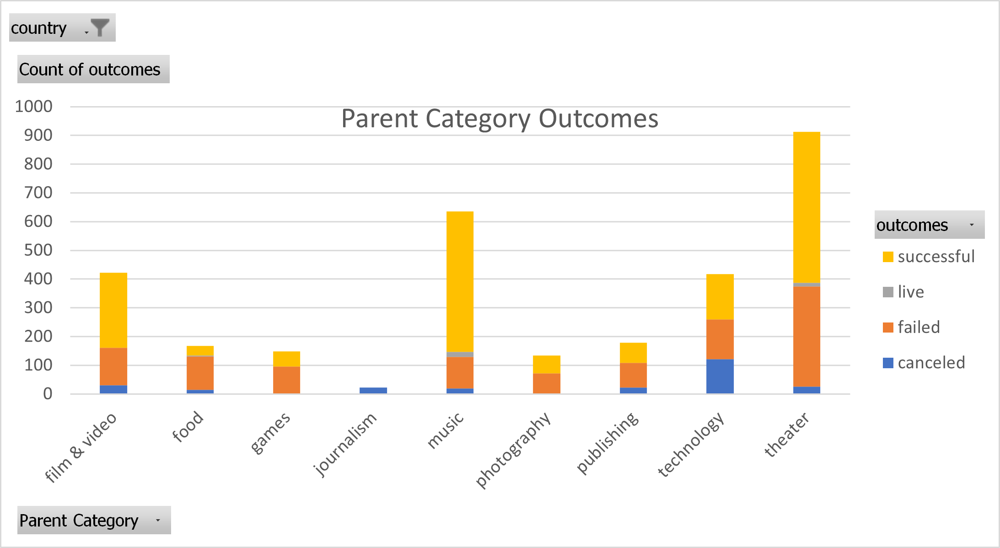

# An Analysis of Kickstarter Campaigns
An analysis was conducted to look into US Kickstarters, both successful and unsuccessful ones. During the analysis, we can conclude that the plays that were successful received donations.
## Parent Category Chart
This chart is a visualization of each category, successful and unsuccessful.

Kickstarter module work for class weeks 1 and 2
